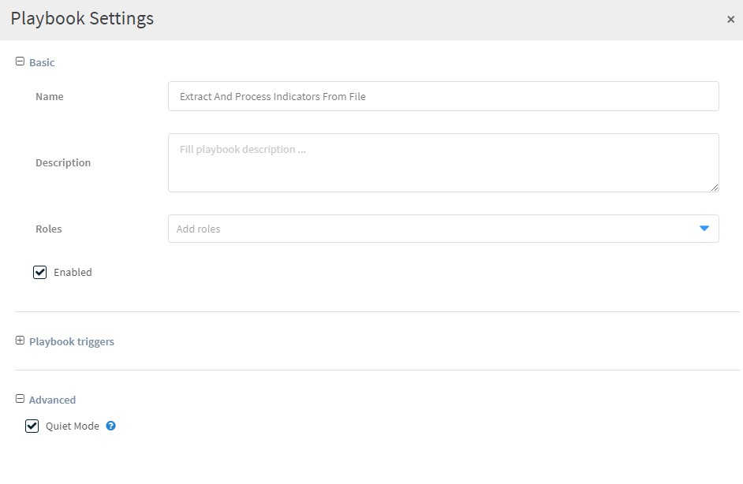

You can manage general playbook settings such as the name, who can edit and run the playbook, as well as for which incident types the playbook runs in the playbook settings.

1. From the **Playbooks** page, click on the playbook whose settings you want to manage.

2. In the upper right-hand corner, click **Settings**.

	1. Under **Roles**, select the roles for which the playbook is available.
	1. Under Playbook triggers, select the Incident Types for which this playbook runs.   **Note**: This will overwrite the settings configured in the respective incident types. The playbook currently defined for the incident type is listed under **Triggered playbook**.
	1. Under **Advanced**, determine if the playbook runs in quiet mode.  
		When **Quiet Mode** is selected, the playbook tasks do not display inputs and outputs and do not auto-extract indicators. Also, when you enable Quiet Mode for tasks or playbooks, war room entries are not created and inputs and outputs are not stored  in the work plan history. In addition, playbook tasks are not indexed so you cannot search on the results of specific tasks. All of the information is still available in the context data, and errors and warnings are written to the War Room. Quiet mode is recommended for scenarios that involve a lot of information to improve performance by increasing playbook speed and saving database size, for example, processing indicators from threat intel feeds. 
		
	

3. Click **Save Version**. 
