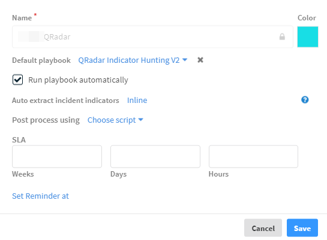

This document takes you through a flow of setting up a SIEM to ingest multiple event types from a single source. It walks you through parts of the planning, integration definition, and classification and mapping stages of the incident lifecycle. For information about the incident lifecycle, see Cortex XSOAR Overview.

This document does not cover every possible scenario in this flow, as that would be impossible. We attempt to give you a real-life scenario touching on certain points from which you can extrapolate to other scenarios.

For purposes of this document, we will be using QRadar.

## Configure the Incident Types

Cortex XSOAR comes with the Access and Authentication incident types configured out of the box. However, we also want to create an additional default incident type for QRadar events that we do not map.

1. Navigate to **Settings** -> **Advanced** -> **Incident Types**.

2. Click **+New Incident Type**.

    a. Under **Name**, enter *QRadar-Default*.
    b. Select the **Run playbook automatically** checkbox.
    c. Under Auto extract incident indicators, select **Inline**.

    

3. Click **Save**.

## Incident Fields

The next thing we need to do is ensure that we have the fields that we want for the information we will be ingesting.

1. Navigate to **Settings** -> **Advanced** -> **Fields**.

2. Click **+New Field**.

    a. In **Field Type**, select *Short text*.
    b. Under **Field Name**, enter *Importance*.
    c. Under **Attributes**, clear the **Associate to all** checkbox.
    d. In the **Add to incident types field**, select **Access** and **Authentication**.

    

3. Click **Save**.

## Customize Incident Type Layout

1. Under the **Incident Types** page, select the Access incident type and click **Edit Layout**.

2. In the **Case Details** section under the **Incident Info** tab, delete the **Playbook** field.

3. From the **Access Fields** menu in the **Library**, drag and drop the *Importance* field to the **Case Details** section.

4. Click the save icon in the upper right-hand corner of the screen.

5. Repeat this process for the Authentication incident type.

 

## Define an Integration Instance

Now that we have the fields that we want, and placed them in the layouts that we will be using, we need to define the QRadar integration instance from which we are fetching incidents.

1. Navigate to **Settings** -> **Integrations** and locate the IBM Qradar integration.

2. Click **Add instance**. 

   a. Enter a name and credentials to connect to the QRadar instance.

   b. Under **Incident type**, select QRadar-Default. This will be used as the default incident type for any incidents that we do not classify. 

   c. Click **Done**.

## Classification and Mapping

Now that we are starting to ingest incidents from QRadar, we need to classify them so they are linked to the correct incident type. In addition, we need to map the attributes from QRadar events to the fields in the incident types.

1. From the Classication and Mapping page, we select the QRadar instance we have configured.

2. When prompted to load event data, select **Pull from the QRadar instance**. In our case, QRadar pulls 20 instances that we can review.

3. We select the *description* attribute as the key based on which we want to classify. 

	

   We see that this results in 6 unique unmapped values out of the 20 events that were pulled. 

4. We drag the values, for example, Access on RDP port and Access by honeypot user to the Access incident types. 

   We'll place Multiple Login Failures for the Same User under authentication, and Blacklisted hash detected in use under Malware.

   Ido port scan will go under Network and DJM will be left untouched. Since we didn't provide any incident time for DJM, it will default to the incident type configured in the instance.

   

5. Save the classifier. Stopping here would mean that we have defined how events originating from QRadar are classified, but we still haven't mapped the event attributes to the fields in the incident types.

6. Click **Create mapping** to map the fields for an authentication event. 

   On the left side of the screen we see all of the fields that are available in an Authentication incident type. On the right side of the screen, we see all of the attributes that are available from the events. 

   a. Next to the Importance field, click **Choose data path**. 

   b. From the QRadar attributes, click **magnitude**. 

   c. Next to the details field, click **Choose data path**.

   	  i. From the QRadar attributes, click **description**. 

   	  ii. Click the curly brackets.

   	  iii. In the **Get** field, enter *description*.

   	  IV. Under **Apply transformers on the field**, click **Add transformer**.

   	  V. Under **Transformer**, click **To upper case** and select the **To string (String)** transformer.

   	  VI. In the **to** field, enter an empty space followed by the string Failure Audit. It should look like this ( Failure Audit).

   	  VII. Click the checkmark icon followed by **OK**.

   d. Next to the name field, click **Choose data path**.

   	  i. From the QRadar attributes, click **description**. 

   	  ii. Click the curly brackets.

   	  iii. In the **Get** field, enter *description*.

   	  IV. Under **Apply transformers on the field**, click **Add transformer**.

   	  V. Under **Transformer**, click **To upper case** and select the **From string** transformer.

   	  VI. In the **from** field, enter a colon. It should look like this (from::).

   	  VII. Click the checkmark icon followed by **OK**.

   	
    
   	e. Click **Done**.

7. Repeat this process for the Access incident type.

When incidents start flowing into Cortex XSOAR from the QRadar instance, we see that those that we classified are mapped to Access or Authentication, and those that we did not, are mapped to the Default-QRadar incident we created above.

## Investigate an Incident

We can then go into one of our incidents, in this case an authentication investigation, and see how the changes we made to our layout and mapping are expressed in the incident itself. Notice that the incident name and details are based on the transformer that we created when we mapped the fields. And the Importance field, which was mapped to the magnitude attribute in QRadar is where we inserted it in the Case Details section.

