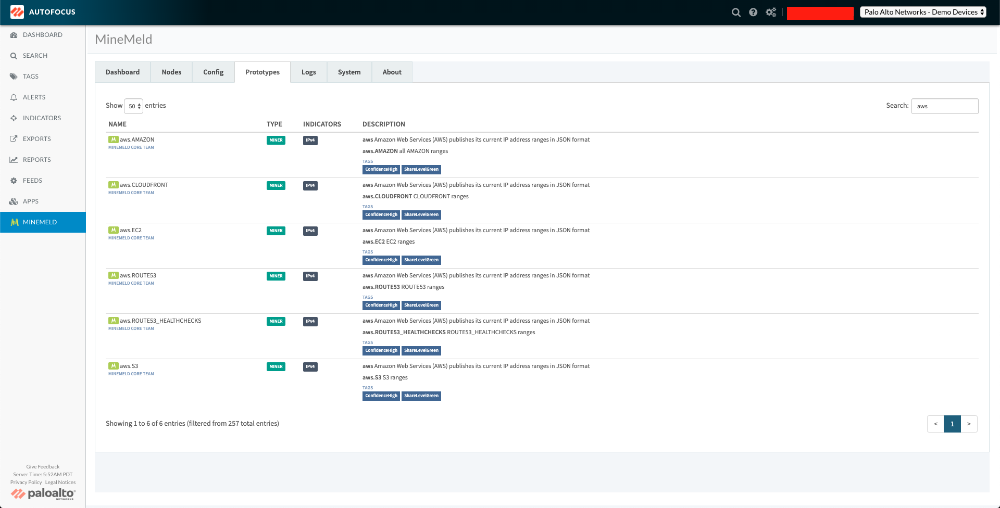
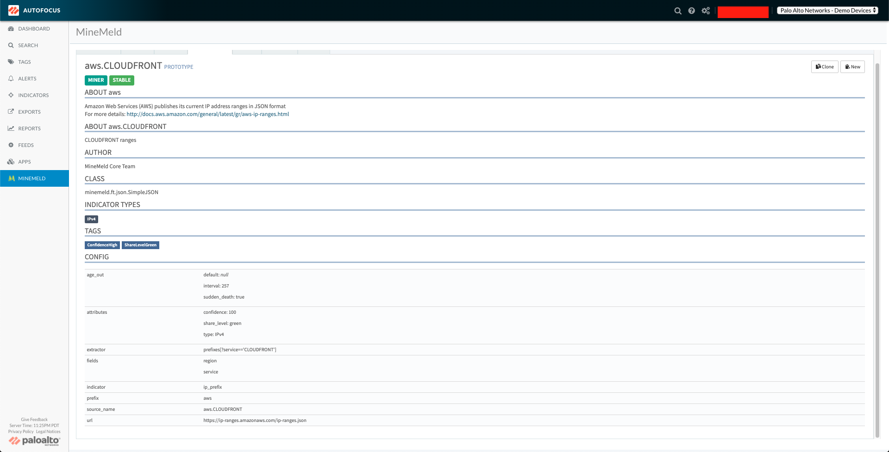
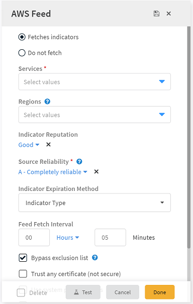
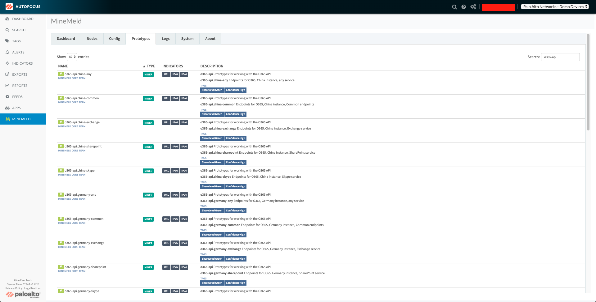
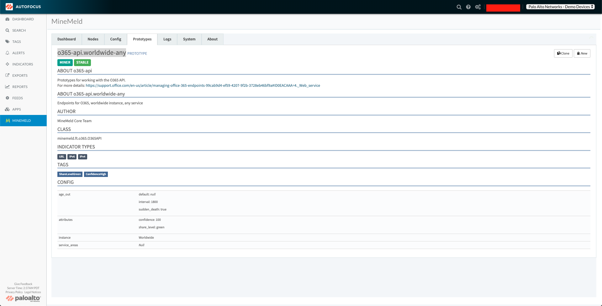
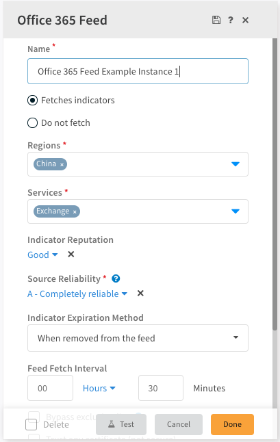
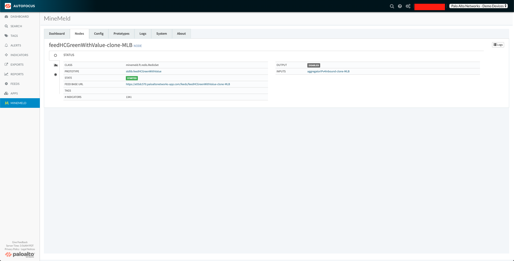
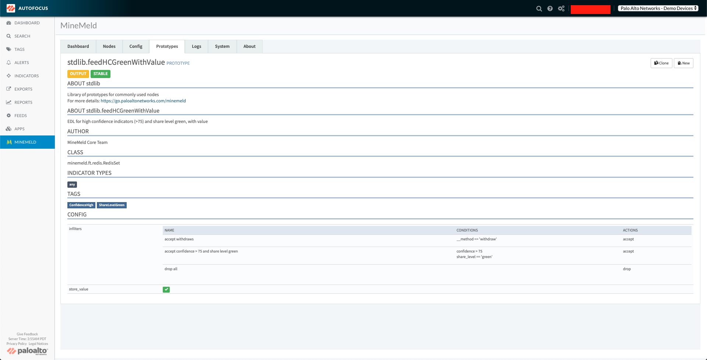
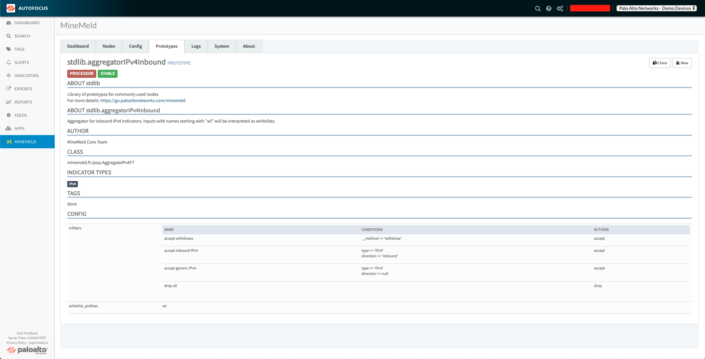
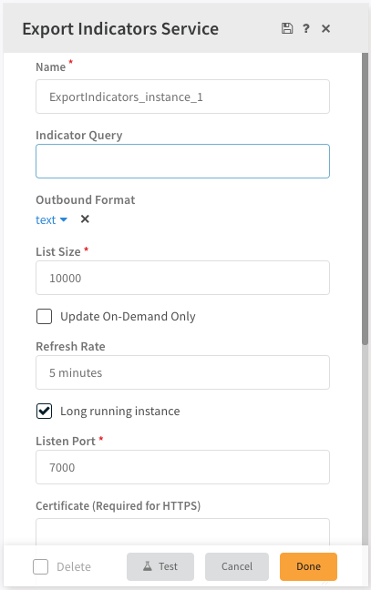

This tutorial explains how to implement the functionality of MineMeld nodes in Cortex XSOAR using a series of integrations. After you complete the tutorial, you’ll be able to perform core MineMeld functions in Cortex XSOAR.

## Conceptual Introduction

In MineMeld, the product revolves around the concept of nodes. There are three types of nodes: "miner", "processor", and "outbound". Together, these three node types represent the entire functionality of MineMeld. Simply put, MineMeld can be broken down into a data flow composed of three steps, data ingestion, data processing, and exporting data, which correspond to the node types "miner", "processor", and "outbound" respectively.

| Node Type | Step |
| ---------- | ---- |
| **miner** | 1. Data Ingestion: ingest data from a variety of sources or _feeds_ |
| **processor** | 2. Data Processing: process the data in some fashion, for example - aggregate data from different sources, filter data by type, tag the data, etc. |
| **outbound** | 3. Data Export: make processed data available for external consumption |

### Data Flow in Cortex XSOAR
In Cortex XSOAR the data flow is is based on two integration types: feed integrations and outbound integrations. Cortex XSOAR provides dedicated out-of-the-box feed integrations for many feed sources, as well as generic feed integrations that you can configure to work with many feed sources. In MineMeld, the outputs of a **miner node** (the indicators fetched from a feed source) need to be specified as the input of other node(s). However, in Cortex XSOAR, all indicators fetched from feed integrations flow into the Cortex XSOAR instance's indicator store. Since the Cortex XSOAR indicator store already supports the mechanism of searching and filtering indicators, we are able to condense what in MineMeld was the flow of indicators into a **processor** node and then an **output** node. We do this by configuring a single instance of the **Export Indicators Service** integration. When configuring an instance of the **Export Indicators Service** integration, we can enter an indicator query (using the query syntax you would use to search and filter indicators in the Indicators page of the Cortex XSOAR platform), which determines the indicators that will be made available from this integration instance for external consumption.


## MineMeld Prototype to Cortex XSOAR Integration Mapping

The **Parameter Configuration** displays any configuration parameters that need to be specified for the corresponding integration in order for the integration instance to fetch indicators from the same source as the related prototype. The required configuration parameters will be presented as a list of keys and values where the key is the name of the configuration parameter and the value is what the user needs to enter or select. If no parameters are listed, this means that the user does not need to specify any parameter values for that integration instance.

| Prototype | Integration | Parameter Configuration |
| --------- | ----------- | ----------------------- |
| alienvault.reputation | Alienvault Reputation Feed | |
| aws.<service> | AWS Feed | **Services**: <service> |
| azure.cloudIPs | Azure Feed | |
| bambenekconsulting.<service> | Bambenek Consulting Feed | **Services**: <service-url> |
| blocklist_de.<service> | Blocklist_de Feed | **Services**: <service> |
| bruteforceblocker.blist | BruteForceBlocker Feed | |
| cloudflare.<service> | Cloudflare Feed | **Services**: <service-url> |
| dshield.block | DShield Feed | |
| fastly.ipv4 | Fastly Feed | |
| feodotracker.badips | Feodo Tracker IP Blocklist Feed | **Feed Source**: Last 30 Days |
| feodotracker.ipblocklist | Feodo Tracker IP Blocklist Feed | **Feed Source**: Currently Active |
| feodotracker.hashes | Feodo Tracker Hashes Feed | |
| malwaredomainlist.ip | Malware Domain List Active IPs Feed | |
| o365-api.&lt;region&gt;-&lt;service&gt; | Office 365 Feed | **Regions**: &lt;region&gt;<br />**Services**: &lt;service&gt; |
| phishme.Intelligence | Cofense Feed | **Username**: &lt;your-cofense-username&gt;<br />**Password**: &lt;your-cofense-password&gt; |
| proofpoint.EmergingThreatsDomains | Proofpoint Feed | **Authorization Code**: &lt;key-from-proofpoint-used-to-access-the-api&gt;<br />**Indicator Reputation**: &lt;what-reputation-to-assign-indicators-fetched-from-this-feed&gt;<br />**Indicator Type**: domain |
| proofpoint.EmergingThreatsIPs | Proofpoint Feed | **Authorization Code**: &lt;key-from-proofpoint-used-to-access-the-api&gt;<br />**Indicator Reputation**: &lt;what-reputation-to-assign-indicators-fetched-from-this-feed&gt;<br />**Indicator Type**: ip |
| recordedfuture.MasterRiskList | Recorded Future RiskList Feed | **Indicator Type**: &lt;the-type-of-indicator-to-fetch-from-this-feed&gt;<br />**API token**: &lt;your-recorded-future-api-token&gt; |
| spamhaus.&lt;service&gt; | Spamhaus Feed | **Services**: &lt;service-url&gt; |
| sslabusech.ipblacklist | abuse.ch SSL Blacklist Feed | **Services**: https://sslbl.abuse.ch/blacklist/sslipblacklist.csv |
| tor.exit_addresses | Tor Exit Addresses Feed | |


## AWS Feed Example

Let's look at a specific example to better understand how to migrate a given MineMeld node. We can migrate the AWS feed shown in the following MineMeld configuration file.
```
  allow-ip_aws_cloudfront:
    inputs: []
    output: true
    prototype: aws.CLOUDFRONT
```
There is a node named `allow-ip_aws_cloudfront` which uses the prototype `aws.CLOUDFRONT`. The `aws` prototypes appear in the AutoFocus-hosted MineMeld UI as in the following screenshot.



When we click the `aws.CLOUDFRONT` prototype, we are presented with additional details. The attributes that we need to configure for an instance of the Cortex XSOAR AWS Feed integration are under the `config` key.



Alternatively, we can also find all of this information in the MineMeld GitHub repository. You can find all out-of-the-box prototypes in the [MineMeld repository on GitHub](https://github.com/PaloAltoNetworks/minemeld-node-prototypes/tree/master/prototypes). In this repository are the files for all MineMeld prototypes. Since the prototype in our example begins with the prefix `aws`, we know the prototype we are looking for can be found in the [aws.yml](https://github.com/PaloAltoNetworks/minemeld-node-prototypes/blob/master/prototypes/aws.yml) file. In this file, if we look under the `prototypes` key for `CLOUDFRONT`, we see the following,
```
    CLOUDFRONT:
        author: MineMeld Core Team
        development_status: STABLE
        description: CLOUDFRONT ranges
        node_type: miner
        indicator_types:
            - IPv4
        tags:
            - ConfidenceHigh
            - ShareLevelGreen
        class: minemeld.ft.json.SimpleJSON
        config:
            source_name: aws.CLOUDFRONT
            url: https://ip-ranges.amazonaws.com/ip-ranges.json
            extractor: "prefixes[?service=='CLOUDFRONT']"
            prefix: aws
            indicator: ip_prefix
            fields:
                - region
                - service
            age_out:
                default: null
                sudden_death: true
                interval: 257
            attributes:
                type: IPv4
                confidence: 100
                share_level: green
```

Let's look at the AWS Feed integration and see how to take these attributes from the MineMeld prototype and translate them to Cortex XSOAR. As shown in the screenshot below, if we do a search for 'aws feed', the _AWS Feed_ integration appears.


Let's configure an instance.



Cortex XSOAR provides default values for many of the configuration parameters as determined by the source of the feed. To configure the integration instance to fetch from the same source as the MineMeld node we are migrating from, we only need to update a single parameter. In this particular case, we only need to click the `Services` dropdown menu and click `CLOUDFRONT`. 


Notice that there is also a multi-select parameter, `Regions`. We could configure this parameter if we wanted to filter indicators returned by this `AWS Feed` integration instance by their associated region data field. For our example, we are returning indicators from all regions, so we do not need to change this parameter. And as easy as that, we've finished configuring an instance. Let's make sure that everything is working properly by clicking the `Test` button at the bottom of the configuration panel. If everything is working as expected, a green 'Success!' message will appear at the bottom of the configuration panel, as shown in the screenshot below.


Click `Done` at the bottom right of the configuration panel and you're all done!


## AWS Feed Continued

As you may have noticed when configuring the `AWS Feed` instance to pull indicators from `CLOUDFRONT`, there were additional services that you could select. So, if your MineMeld configuration contained multiple nodes whose prototypes were prefixed with `aws` as shown below, there are two options for configuring these additional AWS feeds in Cortex XSOAR.
```
  allow-ip_aws_cloudfront:
    inputs: []
    output: true
    prototype: aws.CLOUDFRONT
  allow-ip_aws_ec2:
    inputs: []
    output: true
    prototype: aws.EC2
  allow-ip_aws_s3:
    inputs: []
    output: true
    prototype: aws.S3
```
Let's see how to configure the `allow-ip_aws_ec2` MineMeld node, whose prototype is `aws.EC2`, in Cortex XSOAR. If we want to leave the parameter values for fetching from this feed source the same as what we had for fetching indicators from `CLOUDFRONT`, then there is no need to even create a new instance. Click the cog icon next to the instance we already configured.


In the drop-down menu for the `Services` multi-select field, click `EC2`. 


Now, both `CLOUDFRONT` and `EC2` are selected for this instance. Click `Done` and this `AWS Feed` integration instance will now fetch indicators from AWS's `CLOUDFRONT`  _and_ `EC2` feeds.

If we wanted to configure an instance of the `AWS Feed` integration to fetch from AWS's `EC2` feed _but_ we wanted it configured for different regions than the instance fetching from the `CLOUDFRONT` feed, then we would simply configure a new, separate instance of the `AWS Feed` as described in the [AWS Feed Example](#aws-feed-example) section.


## Office 365 Feed Example

Let's say we wanted to migrate this sample Office 365 node shown in a MineMeld configuration,
```
  allow-multi_o365-worldwide-any:
    inputs: []
    output: true
    prototype: o365-api.worldwide-any
```
There is a node named `allow-multi_o365-worldwide-any` that uses the prototype `o365-api.worldwide-any`. The `o365-api` prototypes appear in the AutoFocus-hosted MineMeld UI.



When we click the `o365-api.worldwide-any` prototype, we are presented with additional details. The attributes we need to configure for an instance of the Cortex XSOAR Office 365 Feed integration are under the `config` key.



Alternatively, we can also find all of this information in the MineMeld GitHub repository. You can find all out-of-the-box prototypes in the [MineMeld repository on GitHub](https://github.com/PaloAltoNetworks/minemeld-node-prototypes/tree/master/prototypes). In this repository are the files for all MineMeld prototypes. Since the prototype in our example begins with the prefix `o365-api`, we know the prototype we are looking for can be found in the [o365-api.yml](https://github.com/PaloAltoNetworks/minemeld-node-prototypes/blob/master/prototypes/o365-api.yml) file. In this file, if we look under the `prototypes` key for `worldwide-any`, we see the following,
```
    worldwide-any:
        author: MineMeld Core Team
        development_status: STABLE
        node_type: miner
        indicator_types:
            - URL
            - IPv6
            - IPv4
        tags:
            - ShareLevelGreen
            - ConfidenceHigh
        description: >
            Endpoints for O365, worldwide instance, any service
        class: minemeld.ft.o365.O365API
        config:
            instance: Worldwide
            service_areas: null
            age_out:
                default: null
                sudden_death: true
                interval: 1800
            attributes:
                confidence: 100
                share_level: green
```

Let's look at the Office 365 Feed integration and see how to take these attributes from the MineMeld prototype and translate them to Cortex XSOAR. As shown in the screenshot below, when we search for 'office 365 feed', the _Office 365 Feed_ integration appears.


Let's configure an instance.


As you can see in the screenshot above, Cortex XSOAR provides default values for many of the configuration parameters, as determined by the source of the feed. To configure the integration instance to fetch from the same source as the MineMeld node we are migrating from, we do not need to make any adjustments because the default values for the **Regions** and **Services** configuration parameters are *Worldwide* and *All* respectively, which are the values we need to migrate this particular prototype. 

Now, click `Done` at the bottom right of the configuration window.

Here are two other cases.
Let's say you want to migrate two other Office 365 prototypes instead of the one previously described, for example,
```yaml
  allow_o365-china-exchange:
    inputs: []
    output: true
    prototype: o365-api.china-exchange
  allow_o365-germany-exchange:
    inputs: []
    output: true
    prototype: o365-api.germany-exchange
```

We can configure one instance of the _Office 365 Feed_ integration with **Regions** set to *China* and *Germany* and **Services** set to *Exchange*, as shown in the following screenshot.


In the second case, let's say you wanted to migrate the two nodes from your MineMeld configuration that appear as follows,
```yaml
  allow_o365-china-exchange:
    inputs: []
    output: true
    prototype: o365-api.china-exchange
  allow_o365-germany-skype:
    inputs: []
    output: true
    prototype: o365-api.germany-skype
```

Since these do not overlap, we should configure two instances of the _Office 365 Feed_ integration. One instance with **Regions** set to *China* and **Services** set to *Exchange* and the other instance with **Regions** set to *Germany* and **Services** set to *Skype* as shown in the screenshots below.




## Migrating Output Nodes

You can output indicators with Cortex XSOAR by using two integrations, _Palo Alto Networks PAN-OS EDL Service_ and _Export Indicators Service_. Migrating MineMeld output nodes to Cortex XSOAR is a process that requires looking at the prototype of a given output node, as well as the prototypes of all of the nodes that flow into that output node. We need to do this to understand how to construct the query we will enter when configuring an instance of the _Palo Alto Networks PAN-OS EDL Service_ or _Export Indicators Service_ integration.

A concrete example will demonstrate how this is done. Here is an example output node in MineMeld.



The first step is to look at the output node's prototype, which we can do by clicking the link `stdlib.feedHCGreenWithValue` as seen in the previous screenshot. It appears as follows.



We see in the `config` section that this prototype filters for indicators whose `confidence` is greater than 75 and whose `share_level` is 'green' - this is the first bit of information we need.
Now let's go back to the node's inputs. We need to explore each one. Our example only has one input node listed - let's explore it by clicking the link there `aggregatorIPv4Inbound-clone-MLB`.


Let's see the details of the node's prototype by clicking the prototype linked there - `stdlib.aggregatorIPv4Inbound`.



We see in the `config` section that this prototype filters for indicators whose `type` is 'IPv4' - let's file this information away for when we configure an integration instance in Cortex XSOAR.
Now if we go back to the aggregator node, we see that it too only has one input node listed. Let's perform the same actions as before and we'll be finished gathering the information we need. Let's click on the input node linked as `exit_addresses-clone-MLB`.


Click on the prototype listed there, `tor.exit_addresses`, to see more details.

We know from the table mapping MineMeld prototypes to Cortex XSOAR integrations detailed [above](#minemeld-prototype-to-cortex-xsoar-integration-mapping) that the `tor.exit_addresses` prototype maps to the _Tor Exit Addresses Feed_ integration. And with that, we have all the information we need to move forward. Let's review and gather here the information we collected from looking at the output node we want to migrate, and all the nodes that flow into it.

1. Filters for indicators whose `confidence` is greater than 75 and whose `share_level` is 'green'
2. Filters for indicators whose `type` is 'IPv4'
3. The `tor.exit_addresses` prototype maps to the _Tor Exit Addresses Feed_ integration

Let's configure an instance of the __Export Indicators Service__ integration using the information we collected to construct the query that defines which indicators are made available. Search for 'export indicators' in your Cortex XSOAR's integrations page as seen in the following screenshot.


When configuring an instance of this integration, we need to provide an `Indicator Query`. The value entered here uses the same query syntax one would use in the Cortex XSOAR's indicators page to filter and search for specific indicators.



So the information we gathered previously, translated to Cortex XSOAR's indicators query syntax would be,
```
type:IP and sourceBrands:"Tor Exit Addresses Feed" and confidence:>75 and trafficlightprotocol:Green
```
Enter that value for the **Indicator Query**.


Finish configuring the integration to your desired specifications and press `Done`.

---
