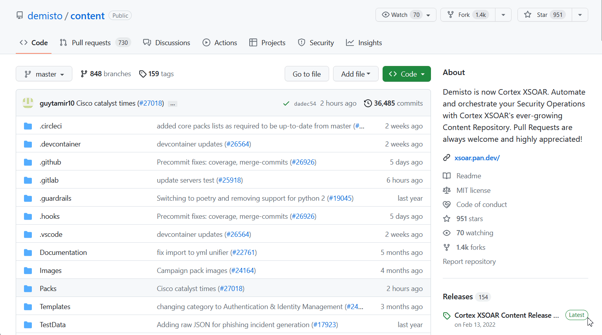
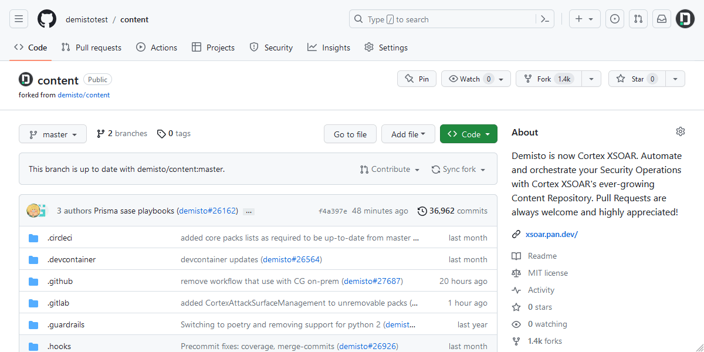

This tutorial provides a step-by-step instructions for setting up a personal Codespace for developing XSOAR content.

## What are GitHub Codespaces?
[GitHub Codespaces](https://github.com/features/Codespaces) are cloud-based development environments provided by [GitHub](https://github.com).  
They allow you to set up remote environments with preinstalled and preconfigured tools and dependencies 
using a [dev container](https://docs.github.com/en/Codespaces/setting-up-your-project-for-Codespaces/adding-a-dev-container-configuration/introduction-to-dev-containers) configuration.

Your Codespace environment will be hosted on GitHub's servers, attached to your GitHub account,
and will allow you to access the same Codespace environment from any computer, continuing your work from where you left off.

### Cost and Limitations
GitHub offers a free quota for Codespaces (which is higher for GitHub Pro users) that you can utilize for developing XSOAR content.  
The quota is calculated based on the number of hours your Codespace is (actively) running, and the amount of storage used.  
You can see the free quota plan and additional information [here](https://docs.github.com/en/billing/managing-billing-for-github-Codespaces/about-billing-for-github-Codespaces#monthly-included-storage-and-core-hours-for-personal-accounts).  

You can find information about your Codespace quota usage on the settings under "Billing and plans". See the following GitHub article for a step-by-step guide: [Viewing your GitHub Codespaces usage](https://docs.github.com/en/billing/managing-billing-for-github-Codespaces/viewing-your-github-Codespaces-usage).  

:::tip
You will receive an email notification when you have used 75%, 90%, and 100% of your (free) included quotas
:::

If you want to use paid usage once you've reached your free quota, you can find information about the pricing [here](https://docs.github.com/en/billing/managing-billing-for-github-Codespaces/about-billing-for-github-Codespaces#pricing-for-paid-usage).  

:::info
Codespaces generated from our Content repository (or a fork of it) use 4-cores by default.
:::

You can check how much of your quota you've already used by checking on your account's settings page.  
You can use [the following official GitHub guide](https://docs.github.com/en/billing/managing-billing-for-github-Codespaces/viewing-your-github-Codespaces-usage) for a step-by-step guide.

## Requirements
* A GitHub account (can be created [here](https://github.com/signup)).

## Setup
This is an initial setup that needs to be done only once.  
After that, the generated environment will be kept in your GitHub account.

### Create a New Codespace
1. [Log in to your GitHub account](https://github.com/login) (if not already logged in).
2. Enter the [XSOAR Content repository](https://github.com/demisto/content).
3. Fork the repository to your account:
   1. Click **Fork** at the top right.
   2. Select your account as the owner, and leave the repository name as is.
   3. Keep the **Copy the master branch only** option selected.
   4. Click **Create fork**.
4. Wait a few seconds for the fork to be created, until you're redirected to your forked repository page.
5. On the fork page, click **Code**, go to the **Codespaces** tab, and click **Create Codespace on master**.
6. A page saying "This Codespace is requesting additional permissions" might appear. If it does, click **Continue without authorizing**.
7. Click **New Codespace** (this might take a few minutes).

### Connect Your IDE to Your Codespace (Optional)
By default, Codespaces opens a browser-based VSCode editor that's connected to the Codespace, and should be enough for most use cases,
but it can also be used in IDEs by using an extension.

#### VSCode (local)
In order to connect to your Codespace from a local VSCode editor, you will need to install the official [GitHub Codespaces extension](https://marketplace.visualstudio.com/items?itemName=GitHub.Codespaces).
For a complete installation & configuration tutorial, refer to the official "[Using GitHub Codespaces in your local development environment](https://docs.github.com/en/Codespaces/developing-in-Codespaces/using-github-Codespaces-in-visual-studio-code)" article by GitHub.  
(You can skip the "Creating a Codespace in VS Code" section, as we've already created a Codespace.)

#### Using JetBrains IDEs (PyCharm, IntelliJ IDEA, etc.)
For connecting to a Codespace from a JetBrains IDE, you will need to install and configure [JetBrains Gateway](https://www.jetbrains.com/remote-development/gateway).  
For a complete installation & configuration tutorial, refer to the official "[Using GitHub Codespaces in your JetBrains IDE](https://docs.github.com/en/Codespaces/developing-in-Codespaces/using-github-Codespaces-in-your-jetbrains-ide)" article by GitHub.

## Development
From here, you can start to developing your content like you would on a local environment (make sure to commit your changes to a new branch that isn't `master`).  

## Additional Information
For additional documentation about GitHub Codespaces, see the official [GitHub Codespaces documentation](https://docs.github.com/en/Codespaces).
