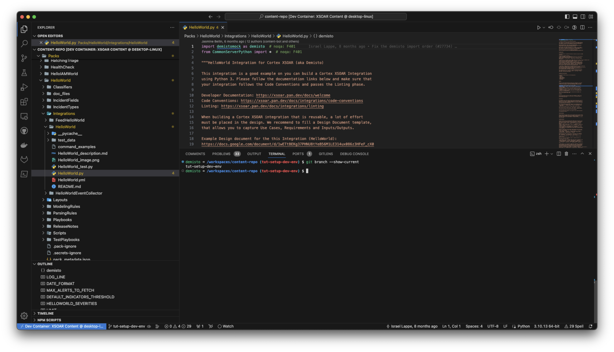

This is a tutorial to set up a fully-functional [development environment in a Docker container](https://code.visualstudio.com/docs/remote/containers). The containarized development environment includes all the necessary tools and dependencies needed to develop content in the [`demisto/content`](https://github.com/demisto/content) repository. 

To set this up a containarized development environment, we need to make sure we have all the prerequesite 

## Requirements

We need to have the following installed on the host machine as described in [System Requirements](https://code.visualstudio.com/docs/devcontainers/containers#_system-requirements):

* [Docker](https://www.docker.com/get-started)
* [Visual Studio Code](https://code.visualstudio.com/)
* [Dev Containers extension](https://marketplace.visualstudio.com/items?itemName=ms-vscode-remote.remote-containers)

 Our suggested host requirements are specified in the [`devcontainer.json`](https://github.com/demisto/content/blob/master/.devcontainer/devcontainer.json):

  * 4 CPUs
  * 8GB of memory
  * 32GB free disk space

We also need a forked/cloned [content repository](https://code.visualstudio.com/docs/devcontainers/containers#_installation) on the host machine.

## Installation

Follow [Installation](https://code.visualstudio.com/docs/devcontainers/containers#_installation).

### Open Repository in VSCode

1. Open VSCode.
2. Go to **File** > **Open Folder**.
3. Select the cloned/forked repository.
4. Create a new branch that will be used for the work.

### Open the Dev Container

1. Click this green button:

    
2. Click **Reopen in Container**.

Alternatively, open the command prompt (CMD + Shift + P) and search for **Reopen in Container**.

Wait a few minutes until the dev container is ready.

## Usage

Once the dev container is ready, a new VS Code window will open where the content repository will be available:



The environment contains `demisto-sdk`, `zsh`, `git`, `pyenv`, `poetry`, preinstalled system and python dependencies, and recommended extensions, including [XSOAR VSCode extension](../concepts/vscode-extension.md).

Follow the [XSOAR VSCode extension](../concepts/vscode-extension.md) to get started with our features.

## Troubleshooting

If there are errors in [opening the dev container](#open-the-dev-container), try the following:

* Update your `Docker`.
* Clean up your `Docker`: 
```bash
  docker system prune -a --volumes
```