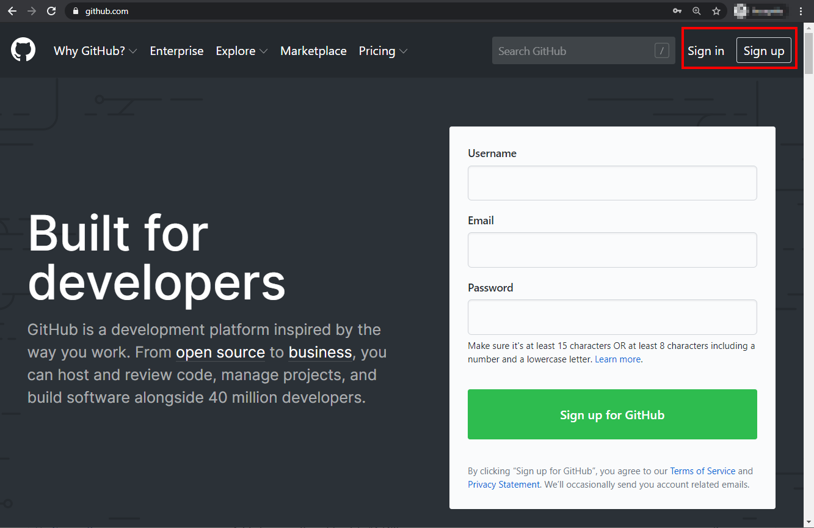

Thank you for showing interest in contributing to the Cortex XSOAR content. We hope this experience will be easy and fun.

This tutorial will guide you on how to set up your dev environment to quickly start developing on Cortex XSOAR. While in Cortex XSOAR you can write code directly in the UI, which is awesome, you'll need a proper development environment external to Cortex XSOAR to contribute a full integration.. This is because, in order to build a full fledged integration, you'll need to *lint* your code, run unit tests with *pytest*, create some documentation, submit your changes via *git* and more.

If you've been through this process already and just want a quick reference, you can jump to the [Development Setup](../integrations/dev-setup) page, otherwise keep reading for more details.

## Which tools should I use?

As mentioned, you'll need a combination of both the Cortex XSOAR UI and other tools. 

As a general rule of the thumb, we recommend that you use an external IDE and toolchain when:
- Working on your [integration code](../integrations/code-conventions) (YourIntegration.py)
- Working on the [unit test script](../integrations/unit-testing) (YourIntegration_test.py)
- Working on the [CHANGELOG.md](../integrations/changelog) and README.md documentation files
- Running the [linting](../integrations/linting) and testing

Instead, you should use the Cortex XSOAR UI when:
- Creating the [Test Playbooks](../integrations/test-playbooks)
- Auto-generate the [integration documentation](../integrations/integration-docs)
- Creating [example playbooks](../playbooks/playbooks) to demonstrate your integration
- Working on the properties of your integration (parameters, commands, arguments, outputs, etc.)
- Testing the User Experience

## What IDE should I use?

When it comes to an External IDE, you should stick to what you're comfortable with.

We developed a free [plugin](https://plugins.jetbrains.com/plugin/12093-demisto-add-on-for-pycharm) for [PyCharm](https://www.jetbrains.com/pycharm/) that simplifies/automates a few tasks such as:
- Running unit tests
- Creating a blank integration or automation script
- Uploading/Downloading your integration code to/from Cortex XSOAR
- Running commands directly on Cortex XSOAR

However, if you want to a different IDE (Visual Studio Code, Sublime, vi, emacs, etc.) it's totally fine! It just means that some of those tasks must be performed manually. To automate them, you can use the  [demisto-sdk](https://github.com/demisto/demisto-sdk). In this tutorial, we will be using it for unit tests, but more features will come in the future.

## Requirements

Here are few requirements to make sure that you an easily build an Cortex XSOAR Integration without running into issues down the road.

### Cortex XSOAR

You need an instance of Cortex XSOAR up and running. You can Sign Up for the [Cortex XSOAR Free Edition](https://start.paloaltonetworks.com/sign-up-for-demisto-free-edition) or, if you're entitled to, contact your Business Development representative to have a non-production license.

### Operating System

So far we've been using the following Operating Systems as development environments for integrations:
- MacOS
- Linux
- Windows (only with WSL - [Windows Subsystem For Linux](https://docs.microsoft.com/en-us/windows/wsl/about))

If you successfully manage to get this work on other platforms (native Windows, OpenBSD, etc.) , please let us know and we'll add it to the tutorial! (click on Report an issue at the bottom of this page).

### Python

You will need to build your integration using **Python** and, more specifically, Python 3.7+. While some content is built via Javascript and Python 2, we require Python 3.7+ for contributions.

**Note**: You don't need to be a a Python expert (I'm not!) to write a good integration, although some intermediate level knowledge is preferred.

It is also recommended to have a dedicated Python 3 installed on your system: for that purpose, please download and install **[pyenv](https://github.com/pyenv/pyenv)**. It allows to easily manage multiple versions of Python on your system.

### GitHub

You will need a **[GitHub](https://github.com)** account, as the contribution process requires you to submit a Pull Request in the [Cortex XSOAR Content Repository](https://github.com/demisto/content). To learn more about Pull Requests and contributing , check out the [Collaborating with issue and pull requests](https://help.github.com/en/github/collaborating-with-issues-and-pull-requests) tutorial on GitHub, as well as our [Content Contribution Guide](https://github.com/demisto/content/blob/master/CONTRIBUTING.md).

And you will need a `git` client on your system (git, GitHub Desktop, SourceTree, etc). In the examples we'll just use the `git` command line client.

### Docker

In order to be able to run linting and tests, you should have **Docker** installed on your machine. This way you can test your code using the same Python environment as the one that will run inside the Cortex XSOAR instance.

*Note* if you're using WSL, you cannot run Docker natively on WSL, but you can install Docker Desktop on Windows and configure WSL to communicate to it using [this](https://nickjanetakis.com/blog/setting-up-docker-for-windows-and-wsl-to-work-flawlessly) tutorial.


## The Tutorial Starts Here

Finally! The tutorial will guide you through the following steps:

1. Verify the requirements
2. Fork the GitHub repo
3. Clone the GitHub fork locally
4. Run the bootstrap script
5. Run the linter and unit tests
6. Create a branch and integration directory
7. Commit and push

OK, let's begin.

### Step 1: Verify the requirements

Let's go make sure that all the requirements are satisfied, one by one.

#### Cortex XSOAR

We are assuming that Cortex XSOAR is already installed. For more information about installing Cortex XSOAR please refer to [this article](https://support.demisto.com/hc/en-us/sections/360001323614-Installing-Demisto) (Support Center credentials are required)

Check if your Cortex XSOAR License is correctly installed by navigating to *Settings* -> *ABOUT* -> *License* and make sure that everything is green:


**PRO tip**: you can quickly navigate to different pages within Cortex XSOAR by hitting *Ctrl-K* and then typing what you want. For the license page, for example, type */settings/license* or just *lic* and select the autocompleted option:


#### Operating System

We assume you have an Operating System and that is working :)

*Note:* if you're using **Windows with WSL**, and your code resides to a shared folder on the Windows tree (i.e. `/mnt/c/code/demisto`), please make sure that the folder is set to be [case sensitive](https://devblogs.microsoft.com/commandline/improved-per-directory-case-sensitivity-support-in-wsl/).

#### Python and pyenv

You will need `python3` installed on your system. We recommend using `pyenv`. At the time of writing, the latest version of Python 3.7 is *3.7.5*.

Make sure `pyenv` in installed and that the `eval "$(pyenv init -)"` expression is placed in your shell configuration (`~/.bashrc` or `~/.zshrc`) - [more information about this](https://github.com/pyenv/pyenv#installation).

```bash
sb@dddd:~/demisto$ eval "$(pyenv init -)"
sb@dddd:~/demisto$ pyenv -v
pyenv 1.2.15
sb@dddd:~/demisto$~/demisto$
```
If it doesn't work, please follow the instructions [here](https://github.com/pyenv/pyenv#installation). Either Homebrew for MacOS or the automatic installer on Linux/WSL work fine.

Make sure that the required version of Python is available:

```bash
sb@dddd:~/demisto$ pyenv versions
  3.7.5
sb@dddd:~/demisto$
```
If it doesn't work, please follow the instructions [here](https://github.com/pyenv/pyenv#installation). Either Homebrew for MacOS or the automatic installer on Linux/WSL work fine.

If it is missing, you will need to install it. As `pyenv` compiles CPython, you might need some libraries. Depending on your OS, [this](https://github.com/pyenv/pyenv/wiki/Common-build-problems) article explains how to install the required dependencies and provides useful troubleshooting info.

Also, it's a good time to take a break as installing might take a bit.

Install Python 3.7.5:

```bash
sb@dddd:~/demisto$ pyenv install 3.7.5
Downloading Python-3.7.5.tar.xz...
-> https://www.python.org/ftp/python/3.7.5/Python-3.7.5.tar.xz
Installing Python-3.7.5...
Installed Python-3.7.5 to /home/sb/.pyenv/versions/3.7.5

sb@dddd:~/demisto$ pyenv versions
  3.7.5
sb@dddd:~/demisto$
```
And that's it! Again, if the installation fails, check out [this](https://github.com/pyenv/pyenv/wiki/Common-build-problems) page.

#### GitHub

Not much to check here, just go to [GitHub](https://github.com) and make sure that you have an account or Sign Up for one:



#### Docker

Make sure that `docker` is installed on your system and is working correctly by running the `hello-world` container:

```bash
sb@dddd:~/demisto$ docker run --rm hello-world

Hello from Docker!
This message shows that your installation appears to be working correctly.

[... output omitted for brevity ...]

For more examples and ideas, visit:
 https://docs.docker.com/get-started/

sb@dddd:~/demisto$
```

*Note:* if you're using Windows with WSL, you can still use Docker Desktop from WSL. Follow [this](https://nickjanetakis.com/blog/setting-up-docker-for-windows-and-wsl-to-work-flawlessly) tutorial for details.

Great, all the prerequisites are set! We can get started.

### Step 2: Fork the GitHub repo

Make sure you're logged on GitHub and navigate to the [Cortex XSOAR Content Repo](https://github.com/demisto/content) and click on **Fork**:


Once the fork is complete, copy the your URL:


This is the fork where you will commit your code and, once ready, create the Pull Request to submit your contribution back to the Cortex XSOAR Content repository.

### Step 3: Clone the GitHub fork locally

Back to the shell, create a folder (in the tutorial we'll use `~/demisto`) and clone your fork of the content repository using `git clone [your_fork_url]`, where `[your_fork_url]` is the URL you copied from GitHub in the previous step:

```bash
sb@dddd:~$ mkdir demisto
sb@dddd:~$ cd demisto
sb@dddd:~/demisto$ git clone https://github.com/[omitted]/content.git
Cloning into 'content'...
remote: Enumerating objects: 108, done.
remote: Counting objects: 100% (108/108), done.
remote: Compressing objects: 100% (90/90), done.
remote: Total 101143 (delta 50), reused 53 (delta 18), pack-reused 101035
Receiving objects: 100% (101143/101143), 110.65 MiB | 11.04 MiB/s, done.
Resolving deltas: 100% (73634/73634), done.
Checking out files: 100% (4522/4522), done.
sb@dddd:~/demisto$
```

*Note:* you must clone **your fork** of the repository, as you will need to be able to write into it. Do **not** clone `demisto/content`, as you won't be able to push commits.

### Step 4: Run the bootstrap script

Before running the `bootstrap` script that creates the virtual environment, let's set up `pyenv` to work correctly in the `content` folder you just cloned.

At the beginning, no local python interpreter has been set via `pyenv`:
```bash
sb@dddd:~/demisto$ cd content
sb@dddd:~/demisto/content$ pyenv local
pyenv: no local version configured for this directory
```

You can tell `pyenv` to use the latest version Python 3 you previously installed and verify that everything is set correctly:
```
sb@dddd:~/demisto/content$ pyenv local 3.7.5

sb@dddd:~/demisto/content$ pyenv local
3.7.5

sb@dddd:~/demisto/content$ which python3
/home/sb/.pyenv/shims/python3

sb@dddd:~/demisto/content$ python3 -V
Ptyhon 3.7.5
```

OK, now you can run the `.hooks/bootstrap` script that will install the dependencies and create the `virtualenv`:
```bash
sb@dddd:~/demisto/content$ .hooks/bootstrap
Installing 'pre-commit' hooks
=======================
Initializing virtual env...
Running virtualenv with interpreter /home/sb/.pyenv/shims/python3
Already using interpreter /home/sb/.pyenv/versions/3.7.5/bin/python3
Using base prefix '/home/sb/.pyenv/versions/3.7.5'
New python executable in /home/sb/demisto/content/venv/bin/python3
Also creating executable in /home/sb/demisto/content/venv/bin/python
Installing setuptools, pip, wheel...
done.
Running virtualenv with interpreter /home/sb/.pyenv/shims/python2
Already using interpreter /home/sb/.pyenv/versions/2.7.17/bin/python2
New python executable in /home/sb/demisto/content/venv/bin/python2

[... output omitted for brevity ...]

Successfully installed GitPython-3.0.5 PyYAML-5.2 atomicwrites-1.3.0 attrs-19.3.0 autopep8-1.4.4 bandit-1.6.2 beautifulsoup4-4.8.1 bs4-0.0.1 certifi-2019.11.28 chardet-3.0.4 demisto-py-2.0.6 demisto-sdk-0.2.6 docopt-0.6.2 entrypoints-0.3 flake8-3.7.8 freezegun-0.3.12 gitdb2-2.0.6 idna-2.8 importlib-metadata-1.3.0 mccabe-0.6.1 more-itertools-8.0.2 mypy-0.730 mypy-extensions-0.4.3 packaging-19.2 pbr-5.4.4 pipenv-2018.11.26 pluggy-0.13.1 py-1.8.0 pycodestyle-2.5.0 pyflakes-2.1.1 pykwalify-1.7.0 pyparsing-2.4.6 pypdf2-1.26.0 pytest-5.2.1 pytest-mock-1.11.1 python-dateutil-2.8.1 pytz-2019.3 requests-2.22.0 requests-mock-1.7.0 ruamel.yaml-0.16.5 ruamel.yaml.clib-0.2.0 six-1.13.0 smmap2-2.0.5 soupsieve-1.9.5 stevedore-1.31.0 typed-ast-1.4.0 typing-extensions-3.7.4.1 tzlocal-2.0.0 urllib3-1.25.7 virtualenv-16.7.9 virtualenv-clone-0.5.3 wcwidth-0.1.7 zipp-0.6.0    ==========================
Done setting up virtualenv at directory 'venv'
Activate the venv by running: . ./venv/bin/activate
Deactivate by running: deactivate
sb@dddd:~/demisto/content$
```

*Note*: if you are using WSL and you see some errors about "python.exe" getting called, disable it in App Execution Alias ([details](https://superuser.com/questions/1437590/typing-python-on-windows-10-version-1903-command-prompt-opens-microsoft-stor)).

Everything is configured, and you can start developing. When you work on your integration, you can activate the `virtualenv` with the `activate` command:
```bash
sb@dddd:~/demisto/content$ . ./venv/bin/activate
(venv) sb@dddd:~/demisto/content$
```

Note the `(venv)` in front of the prompt. You can always leave the `virtualenv` using the `deactivate` command:

```bash
(venv) sb@dddd:~/demisto/content$ deactivate
sb@dddd:~/demisto/content$
```

### Step 5: Run the linter and unit tests

Our content ships with an `HelloWorld` integration that provides basic functionality and is useful to understand how to create integrations.

It's located in the `Packs/HelloWorld/Integrations/HelloWorld` folder. We will use `demisto-sdk` to run the *linting* and *unit testing* in order to make sure that everything is fine with the dev environment (python, docker, etc.).

First, make sure you are running inside the `virtualenv`:
```bash
sb@dddd:~/demisto/content$ . ./venv/bin/activate
(venv) sb@dddd:~/demisto/content$
```

Then, make sure that `demisto-sdk` has been installed automatically by the bootstrap script as part of the preqreuisites:
```bash
(venv) sb@dddd:~/demisto/content$ demisto-sdk
Use demisto-sdk -h to see the available commands.
```

Now, run the `demisto-sdk lint` command on the folder `Packs/HelloWorld/Integrations/HelloWorld` using the `-d` option,
 or if you want to run  against all the committed files in your branch you can use `demisto-sdk lint -g`.
It will run both the [linters](../integrations/linting) and [pytest](../integrations/unit-testing):
```bash
(venv) sb@dddd:~/demisto/content$ demisto-sdk lint -d Packs/HelloWorld/Integrations/HelloWorld
Detected python version: [3.7] for docker image: demisto/python3:3.7.4.2245
========= Running flake8 ===============
flake8 completed
========= Running mypy on: /home/sb/demisto/content/Packs/HelloWorld/Integrations/HelloWorld/HelloWorld.py ===============
Success: no issues found in 1 source file
mypy completed
========= Running bandit on: /home/sb/demisto/content/Packs/HelloWorld/Integrations/HelloWorld/HelloWorld.py ===============
bandit completed
2019-12-27 10:27:17.789503: Existing image: devtestdemisto/python3:3.7.4.2245-3e5eff7d0ddbf839419495ab81a26c54 not found will obtain lock file or wait for image
2019-12-27 10:27:17.791519: Obtained lock file: .lock-devtestdemisto-python3:3.7.4.2245-3e5eff7d0ddbf839419495ab81a26c54    2019-12-27 10:27:17.791991: Trying to pull image: devtestdemisto/python3:3.7.4.2245-3e5eff7d0ddbf839419495ab81a26c54        Pull succeeded with output: 3.7.4.2245-3e5eff7d0ddbf839419495ab81a26c54: Pulling from devtestdemisto/python3

[... output omitted for brevity ...]

1158abee0d53: Download complete
1158abee0d53: Pull complete
Digest: sha256:7132d0335cebd6c90d242b30e9fc67cf8edb12bb190b439924906deeba9a7941
Status: Downloaded newer image for devtestdemisto/python3:3.7.4.2245-3e5eff7d0ddbf839419495ab81a26c54
docker.io/devtestdemisto/python3:3.7.4.2245-3e5eff7d0ddbf839419495ab81a26c54


======== Running pylint on files: HelloWorld.py ===========
Pylint completed with status code: 0
========= Running pytest ===============
collecting tests...
============================= test session starts ==============================
platform linux -- Python 3.7.4, pytest-5.0.1, py-1.8.0, pluggy-0.13.0 -- /usr/local/bin/python
cachedir: .pytest_cache
rootdir: /devwork
plugins: mock-1.11.1, asyncio-0.10.0, xdist-1.30.0, forked-1.1.1, requests-mock-1.7.0
collecting ... collected 2 items

HelloWorld_test.py::test_say_hello PASSED                                [ 50%]
HelloWorld_test.py::test_say_hello_over_http PASSED                      [100%]

=========================== 2 passed in 0.40 seconds ===========================
Pytest completed with status code: 0

(venv) sb@dddd:~/demisto/content$
```

Note that the tests run within a Docker container so, if everything worked well, it means that your development environment is up and running correctly!

### Step 6: Create a branch and integration directory

The [Git Flow](https://help.github.com/en/github/collaborating-with-issues-and-pull-requests) requires to create a *branch* with your new code, that you will later use to submit a *Pull Request*. This tutorial doesn't mean to be an exhaustive guide on how to use `git`: its purpose is just to make sure that you have all the requirements and tools in place to successfully develop a Cortex XSOAR Integration.

In order to create a branch, use the  `git checkout -b [branch_name]` command, where the name of the branch corresponds to your integration:

```bash
(venv) sb@dddd:~/demisto/content$ git checkout -b my_integration_name
Switched to a new branch 'my_integration_name'
```

Now, use `demisto-sdk` to create a directory under `Packs/<Your pack name>`, named after your product where you will put all your content files later, and add it to the staged changes in `git`.  
For more description regarding what exactly a pack is please click [here](../integrations/packs-format). 

Make sure you use **PascalCase** in the directory name (i.e. `MyIntegration`), you can create a Pack and an Integration directory using the `demisto-sdk init` command.

An example of creating a pack called `MyNewPack`, with an integration called `MyIntegration`, and with the metadata file created automatically: 
```bash
➜  content-docs2 git:(add-pack-and-sdk-docs) ✗ demisto-sdk init --pack 
Please input the name of the initialized pack: MyNewPack
Successfully created the pack test in: MyIntegration

Do you want to fill pack's metadata file? Y/N y

Display name of the pack: MyNewPack

Description of the pack: A description for my newly created pack.

Support type of the pack: 
[1] demisto
[2] partner
[3] developer
[4] community

Enter option: 2

Server min version: 5.0.0

Author of the pack: Partner name 

The url of support, should represent your GitHub account (optional): https://github.com/<PartnerGitAccount>

The email in which you can be contacted in: partner@partner.com

Pack category options: 
[1] Analytics & SIEM
[2] Utilities
[3] Messaging
[4] Endpoint
[5] Network Security
[6] Vulnerability Management
[7] Case Management
[8] Forensics & Malware Analysis
[9] IT Services
[10] Data Enrichment & Threat Intelligence
[11] Authentication
[12] Database
[13] Deception
[14] Email Gateway

Enter option: 1

Tags of the pack, comma separated values: 
Created pack metadata at path : MyNewPack/metadata.json

Do you want to create an integration in the pack? Y/N y
Please input the name of the initialized integration: test
Do you want to use the directory name as an ID for the integration? Y/N y
Finished creating integration: MyNewPack/Integrations/test.

```

### Step 7: Commit and push

The last step is to `commit` your changes and `push` them to the *origin* in order to make sure that the pre-commit checks work fine.

But you can also run the hooks locally using the demisto-sdk, in order to do that you can run the commands:  
1. `demisto-sdk format` - this will auto correct couple of things in order for our validation to pass. 
You can see the [docs](https://github.com/demisto/demisto-sdk/blob/master/demisto_sdk/commands/format/README.md)  
2. `demisto-sdk validate -g` - this will validate the integrity of the yml files, and will make sure they follow 
our pre-set of roles. You can see the [docs](https://github.com/demisto/demisto-sdk/blob/master/demisto_sdk/commands/validate/README.md)  
3. `demisto-sdk lint -d <The path to your changed/newly added content entity>` - this will run lint and pytest on your 
changed python files. You can see the [docs](https://github.com/demisto/demisto-sdk/blob/master/demisto_sdk/commands/lint/README.md)  


First, run a `git commit -m '[some commit message]'`, which will automatically run the pre validation checks:


```bash
(venv) sb@dddd:~/demisto/content$ git commit -m 'Initial commit of MyIntegration'
Validating files...
Starting validating files structure
Using git
Running validation on branch my_integration_name
Validates only committed files
Starting validation against origin/master
The files are valid
Starting secrets detection
Finished validating secrets, no secrets were found.

Skipping running dev tasks (flake8, mypy, pylint, pytest). If you want to run this as part of the precommit hook
set CONTENT_PRECOMMIT_RUN_DEV_TASKS=1. You can add the following line to ~/.zshrc:
echo "export CONTENT_PRECOMMIT_RUN_DEV_TASKS=1" >> ~/.zshrc

Or if you want to manually run dev tasks: ./Tests/scripts/pkg_dev_test_tasks.py -d <integration/script dir>
Example: ./Tests/scripts/pkg_dev_test_tasks.py -d Scripts/ParseEmailFiles

On branch my_integration_name
Untracked files:
        .python-version

nothing added to commit but untracked files present
```

Don't worry about the `.python-version` file warning, that is generated by  `pyenv` and shouldn't be added to the repository.

*Note*: since there are no files yet in the directory you have created (`Integrations/MyIntegration` in the example), it will not show up in your branch after the commit. Again, the purpose of this tutorial is just to make sure that all the components are in place.

If everything worked fine so far, now you can *push* to your branch with the command `git push origin [branch_name]`. You will be prompted for your GitHub credentials:

```bash
(venv) sb@dddd:~/demisto/content$ git push origin my_integration_name
Username for 'https://github.com': [omitted]
Password for 'https://[omitted]@github.com':
Total 0 (delta 0), reused 0 (delta 0)
remote:
remote: Create a pull request for 'my_integration_name' on GitHub by visiting:
remote:      https://github.com/[omitted]/content/pull/new/my_integration_name
remote:
To https://github.com/[omitted]/content
 * [new branch]          my_integration_name -> my_integration_name
(venv) sb@dddd:~/demisto/content$
```

You can go back to GitHub and, under **your** fork, you should be able to see that there is a new branch with the name you provided (`my_integration_name` in this example):


Congratulations! You completed the set up of the Development Environment for Cortex XSOAR! Now you can start writing your code. Please have a look at the [Code Conventions](../integrations/code-conventions).

Thank for your time, we hope you enjoyed this tutorial. Please report issues and suggestions using the link below!
