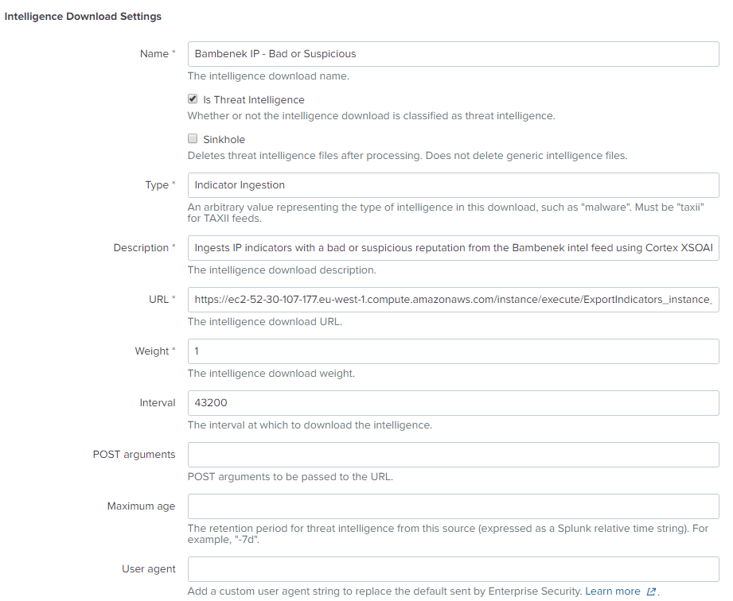

Starting with version 5.5, you can export the indicators in Cortex XSOAR to your SIEM or EDL using the Export Indicators Service integration. This integration exports indicators to a file based on a query that you define. 

In this tutorial, we are going to configure the Export Indicators Service to export indicators with a bad or suspicious reputation coming from a specific Threat Intel Management (TIM) feed. We will then configure Splunk to import these indicators.

## Define the Export Indicators Service

1. Navigate to **Settings > Integrations > Servers and Services** and search for *Export Indicators Service*.

1. Click **Add instance**.

	1. Under **Indicator Query**, we enter the following:
		`sourceBrands:"Bambenek Consulting Feed" AND type:IP AND (reputation:Bad OR reputation:Suspicious)`
		This will bring us all IP indicators coming from the Bambenek feed, which have a reputation of either 'Bad' or 'Suspicious'.

	1. Under **Outbound Format**, we select *CSV*. In this format, only the indicator is exported.  If we want to export the indicator with all of its metadata, we could select *XSOAR CSV*. This is useful for situation where you want to ingest additional data into Splunk.

	1. We ensure that the **Long running instance** checkbox is selected. This keeps communication between the 3rd party application consuming this data and the integration constant. The integration will not work if this checkbox is not selected.

	1. Under **Listen Port**, we enter 7000 as the port through which you want to connect to the integration. 

	1. (Optional) Cortex XSOAR recommends that you configure the instance to require a username and password. We click **Switch to username and password** and enter the authentication credentials.

	1. We must also select the **CSV as Text** checkbox. This means the query results will be hosted on the server at the port or address that we configured so Splunk can access the information as a web service. 

	

1. Click **Done**. 

## Configure Cortex XSOAR to Allow External Connections

To enable external applications to access the Export Indicators Service integration, we must add a server configuration.   **Note**: As this server configuration opens our system to external access, we made sure when configuring the integration instance, to use authentication credentials.

1. Navigate to **Settings > About > Troubleshooting**.

1. In the **Server Configuration** section, we verify that the instance.execute.external key is set to true. 

## Configure Splunk Enterprise

Now that we have configured the Cortex XSOAR side of things, we need to configure Splunk to ingest the information.

1. Log in to splunk enterprise.

1. Under **Apps**, we select **Enterprise Security**.

1. From the menu, click **Configure > Data Enrichment > Intelligence Downloads**.

1. Click **New**. 

	1. In the Intelligence Download Settings section, we enter the following:

	   * A meaningful name so we can identify what the intelligence download does from the main view.

	   * Verify **Is Threat Intelligence** is selected.

	   * Provide more detailed information about exactly what we are getting in this feed in the **Description** field.

	   * Enter the following as the **URL**: 
		`https://<Cortex XSOAR_address>/instance/execute/instance_name`

	 		where

	 	   * Cortex XSOAR_address is the URL of your Cortex XSOAR instance 
	 	   * instance_name is the name of the integration instance.

	 		For example, `https://myCortexXSOAR.com/instance/execute/ExportIndicators_instance_1`

	   * The reliability or confidence we have in the source of this information in the **Weight** field.

	 

	 1. Under **Parsing Options**:

	    * As we have a CSV file, we enter *,* as the **Delimiting regular expression**. 

	    * The **Fields** should be entered as follows:
	 		ip:"$9"

	 	  * ip is the indicator type as it is called in Splunk.
	 	  * $9 is the column in the csv file in which the value is located.

	    * Under **Skip header lines**, we enter 1, as that is the header row in our CSV file.

	 

1. Click **Save**.

## Validate the Feed is Ingested by Splunk

After defining the feed in Splunk, we want to ensure that the indicators are being ingested.

1. Under **Apps**, we select **Enterprise Security**.

1. From the menu, we'll navigate to **Security Intelligence > Threat Intelligence > Threat Artifacts**.

1. Under **Threat Group**, we select the Intelligence object that we created earlier and click **Submit**.

Under the Network tab, in the IP Intelligence section, we can see that our indicators are avaiable, meaning our ingestion process worked.

