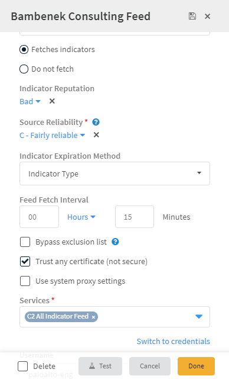
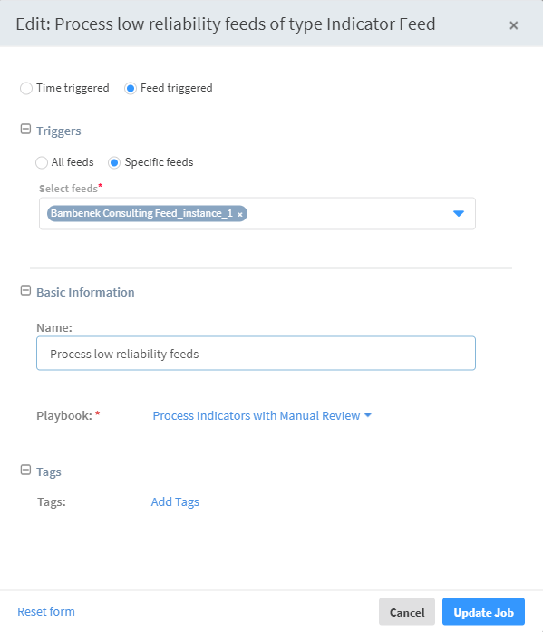

This tutorial walks you through setting up a playbook to take indicators from a threat intel feed, enrich the indicators, and push them to your SIEM. 

1. Define a threat intel feed to ingest indicators to your system.

2. Customize a playbook that is triggered by the feed to process the indicators and determine which are legitimate.

3. Define a feed-triggered job that runs every time indicators are ingested by the feed.

4. Review the indicators and determine with which tags each indicator should be tagged.

5. Customize a job that is time-based to push the indicators to the SIEM.

This tutorial does not cover every possible scenario in this flow. It provides a real-life scenario that touches on important points from which you can extrapolate to other scenarios.

## Configure the Threat Intel Feed

Cortex XSOAR comes with the several TIM feeds out of the box. In this flow, we will define the Bambenek Consulting feed.

1. Navigate to **Settings > Integrations > Servers and Services** and search for Bambenek.

2. Click **Add instance**.

    1. Under **Sub-Feeds**, select from where you want to pull the data.

    2. Determine the default reputation that you want indicators from this feed to receive. 

    3. You can change the **Source Reliability**. By default, Cortex XSOAR defines this feed as C - fairly reliable.

    4. Determine when the indicator expires and how often to fetch indicators from the feed.

    

3. Click **Done**.

## Create List of Indicators not to Process

Before you can customize your playbook, you should first create a list(s) for indicators that you want to exclude from the manual review process.

1. Navigate to **Settings > Advanced > Lists**.
    For purposes of this example, we will create a list of business partner IP addresses.

2. Click **Add a list**. 

    1. Enter a meaningful name for the list. For example, BusinessPartnersIPaddresses.

    2. In the data field, enter a comma-separated list of IP addresses of your business partners.
    
3. Click **Save**.

## Customize your Playbook

After configuring the feed, we need to customize the playbook to process the indicators and determine which are legitimate.

1. Navigate to **Playbooks** and search for the **Process Indicators - Manual Review** playbook. This is the playbook we will trigger in our feed-triggered job.

2. Click the **Playbook Triggered** task at the top of the playbook. 

    1. Under the **Inputs** of the **From context data** radio button, we put a value of *Yes* so an incident with our indicators for review will open automatically. 

    2. Select the **From indicators** radio button.

    3. Under **Query**, enter a query to process the specific indicators that you want. For example, sourceBrands:"Bambenek Consulting Feed".

    4. Click **Save**.

    

3. Click **Save Version**.

At this point, you have the option of excluding certain IPs, hashes, domains and more from the review process using the list(s) you created earlier.

4. Search for the **Indicator Auto Processing** playbook.

    1. Click **Edit**.
    
    2. Click on the sub-playbook task for the entity that you do not want to process. For example, to exclude business partner IP addresses, click on the **Process Indicators Against Business Partners IP List** task.

    3. Under **Inputs**, enter the name of the list. In our example earlier, we used *BusinessPartnersIPaddresses*.

    4. Click **Ok**.

## Define a Feed-Triggered Job

Now that the feed and playbook are set up, you need to define a job that will trigger the playbook when the indicators are fetched.

1. Navigate to **Jobs** and click **New Job**.

    1. Select the **Feed triggered** radio button.

    2. Under **Triggers**, select **Specific feeds** and select the feed whose completion will trigger this job. In this case, it should be the Bambenek Consulting feed you defined earlier.

    3. Enter a descriptive name for the job.

    4. Select the ***Processing Indicators That Require Manual Review*** playbook to run when this job is triggered. 

2. Click **Create New Job**.

## Customize the Add All Indicator Types To SIEM Playbook

Now that we have the infrastructure for pushing the feeds set up, we need to customize the ***Add All Indicator Types To SIEM*** playbook. This playbook, as it is aptly named, pushes the indicators that have been tagged to their respective lists in the SIEM. By default, the playbook is configured to work with ArcSight and QRadar, however, you should change this to match the SIEM in your system. 

## Define a Job to Push the Indicators to the SIEM

After setting up all of the infrastructure, we need to create one final job to push all of the content that we tag to our SIEM. 

1. Navigate to **Jobs** and click **New Job**.

    1. Select the **Time triggered** radio button.

    2. Select the **Recurring** checkbox and determine how often you want the job to run.

       In our example, we have it run daily at midnight.

    3. Enter a descriptive name for the job.

    4. Under **Playbook**, select the Add All Indicator Types To SIEM playbook to run when this job runs. 

2. Click **Create New Job**.

## Test the Flow

Now that everything is set up, let's test the flow.

1. Navigate to **Settings > Integrations > Servers and Services** and edit the setting for the Bambenek instance we created earlier.

    1. Click **Re-fetch indicators from this instance**.

    2. Click **Fetch**.

2. Navigate to **Jobs**.   The feed-triggered job we created earlier should be running.

    1. Click **Running**.   This takes you into the actual job.

    2. Navigate to the **Work Plan** page and click on the task labeled *Create Process Indicators Manually incident*.

    3. Under the **Outputs** tab, note the incident ID for the incident that was created.

    

3. Navigate to **Incidents** and click on the incident that was created in the previous step.

    1. Under the **Indicators** page, click on an indicator. 
    
    2. Click the edit icon and add the tags that apply to the indicator. We have added the approved_black tag. This is the tag that the Add All Indicator Types To SIEM playbook used to determine what needs to be pushed. If you use a different tag, make sure to change the playbook accordingly.   **Note** You can add tags in bulk to multiple indicators from the main Indicators page, however you will not be able to remove any tags that are already applied to an indicator.
    

    3. Under the **Work Plan** page, click the *Manually review the incident* task, select the **Yes** radio button, and click **Mark Completed**.

4. Navigate to **Jobs**. 

    1. Select the time-triggered job you defined to push content to the SIEM and click **Run now**. 

    2. Click **Running**.

    3. Under the **Work Plan** page, verify that the playbook completed. 

5. Navigate to **Indicators** and in the query, enter *tags:SIEM*. This is the tag appended to every indicator that has been processed and pushed to the SIEM.

        
